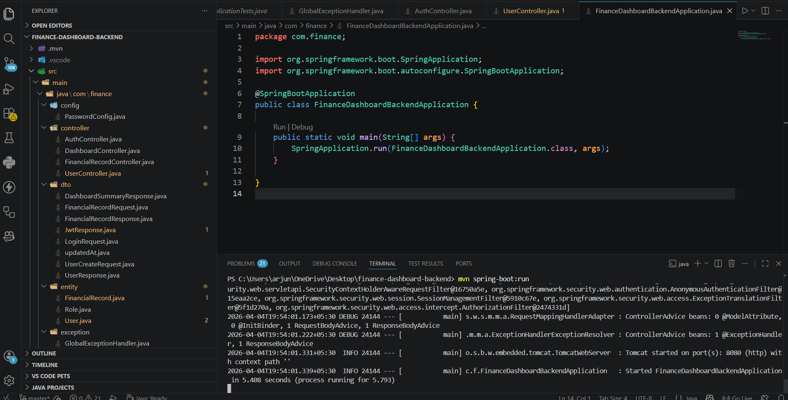
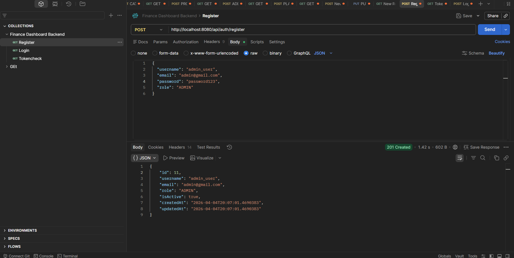
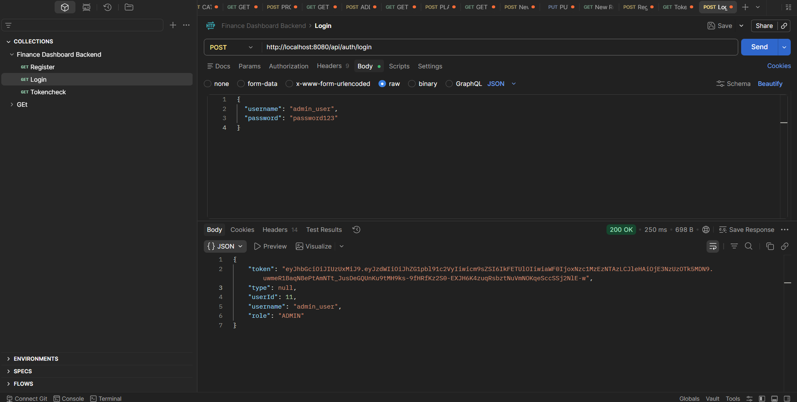
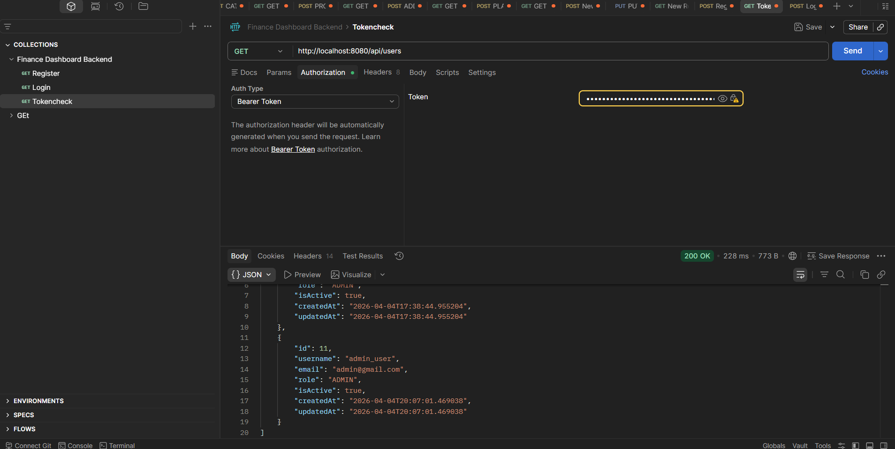
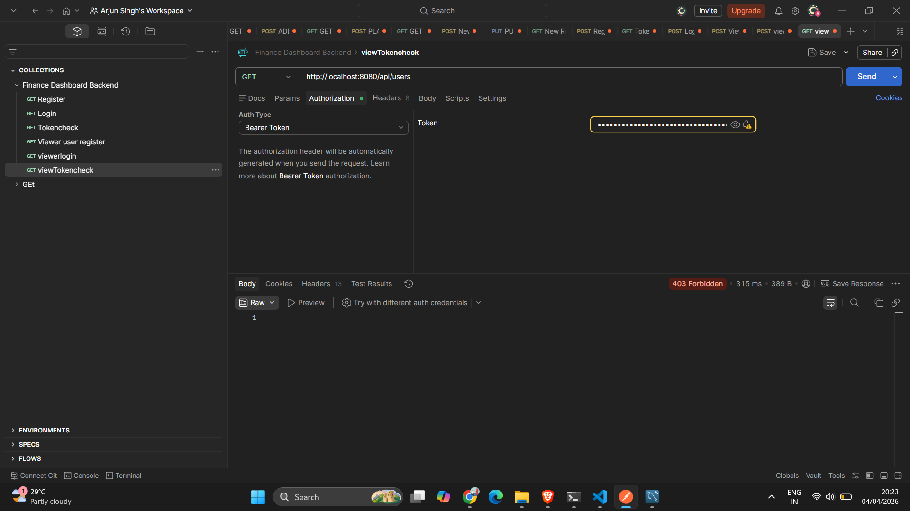
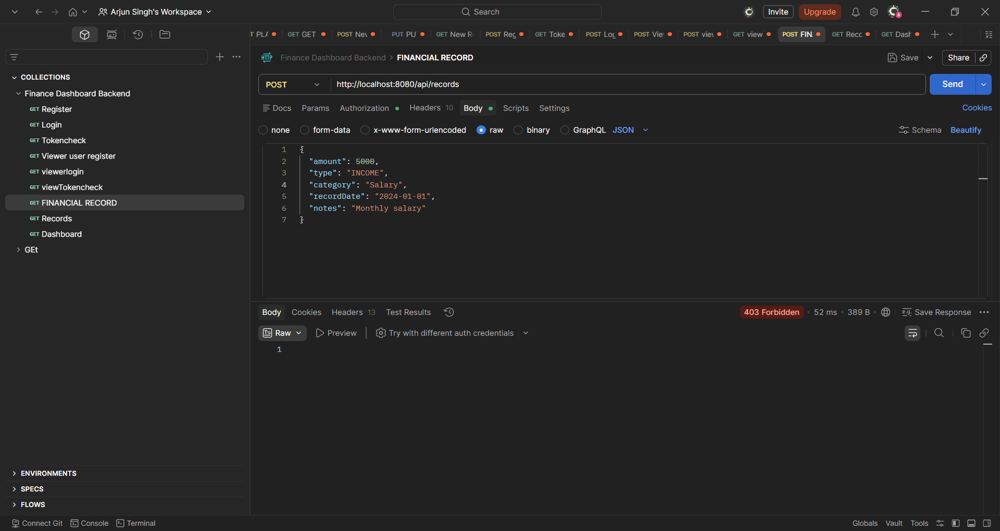
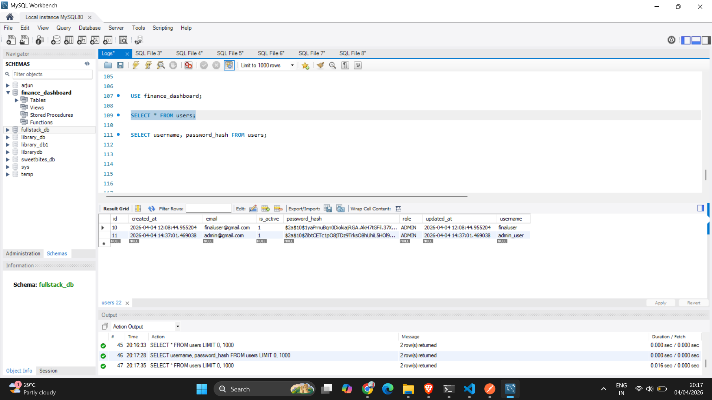

# 💰 Finance Data Processing & Access Control Backend


A robust backend system for managing financial records with **role-based access control**, **secure authentication**, and **dashboard analytics**.

This project demonstrates backend architecture, API design, authentication, authorization, and clean data handling.

---

## 🚀 Features

### 🔐 Authentication & Authorization
- JWT-based login system
- Secure password hashing (BCrypt)
- Role-based access control:
  - 👁️ Viewer → Read-only access
  - 📊 Analyst → Records + dashboard access
  - 🛠️ Admin → Full control (users + records)

---

### 👤 User Management
- Register new users
- Login with JWT token
- Assign roles (ADMIN, ANALYST, VIEWER)
- Manage user status (active/inactive)
- Admin-only user APIs

---

### 💳 Financial Records
- Create financial entries
- View all records
- Update records
- Delete records
- Filter by:
  - Type (Income / Expense)
  - Category
  - Date

---

### 📊 Dashboard APIs
- Total Income
- Total Expenses
- Net Balance
- Category-wise summary
- Recent transactions

---

### 🛡️ Security
- JWT Authentication Filter
- Stateless session (Spring Security)
- Role-based endpoint protection
- CORS configured

---

## 🖼️ Project Screenshots

### 🟢 Server Running


### 🔐 Register API


### 🔑 Login API (JWT Token)


### 🎟️ Token Verification


### 👤 Role-Based Access (Viewer)


### 💰 Financial Records API


### 🗄️ Database View


---

## 🧰 Tech Stack

- **Backend**: Spring Boot
- **Language**: Java
- **Security**: Spring Security + JWT
- **Database**: MySQL
- **Build Tool**: Maven
- **Testing Tool**: Postman

---

## ⚙️ Getting Started

### 1️⃣ Clone Repository
```bash
git clone https://github.com/Arjunsingh-7/Finance-Data-Processing-and-Access-Control-Backend.git
cd Finance-Data-Processing-and-Access-Control-Backend
